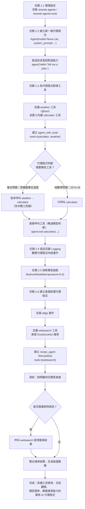

# `Task.ipynb` 逐步詳細解析

> 對應筆記本：`Task.ipynb`（英文版，`Task_zh_TW.ipynb` 為對應的繁體中文版，步驟與程式碼完全相同）

---

## 一、整體目的（總覽）

這份筆記本的核心目標，是帶你從零開始，用 **Strands Agents 框架** 搭配 **Amazon Bedrock（Amazon Nova Lite 模型）**，一步步建立出一個具備「思考、選擇工具、採取行動」能力的 AI 代理程式（Agent），而不只是一個單純問答的 LLM。

整體共分成 6 個子任務，脈絡是：**先建立最簡單的對話代理 → 幫它加上工具讓它會「做事」→ 開日誌看它內部怎麼決策 → 調整模型參數控制它的行為 → 最後整合網路搜尋，做出一個真正能上網查資料的「食譜助理」實戰範例。**

---

## 二、逐步詳細說明

### 任務 2.1　環境設定（Cell 3）

**目的**：安裝建立 AI 代理程式所需的基礎套件。

**詳細說明**：
```python
# %pip install strands-agents strands-agents-tools
```
此格被註解掉（表示在正式環境中已預先安裝好），實際執行時會安裝：
- `strands-agents`：核心框架，提供 `Agent`、`tool` 等類別/裝飾器。
- `strands-agents-tools`：官方提供的現成工具集合（例如稍後用到的 `calculator`）。

這一步是整個筆記本的地基，之後所有 `from strands import ...` 的程式碼都仰賴這裡安裝的套件。

---

### 任務 2.2　建立你的第一個 AI 代理程式（Cell 5、7）

**目的**：用最少的程式碼建立一個能對話的代理程式，理解 `Agent` 物件的基本組成。

**詳細說明**：

Cell 5：
```python
import warnings
warnings.filterwarnings(action="ignore", message=r"datetime.datetime.utcnow")

from strands import Agent

agent = Agent(callback_handler=None,
    model="amazon.nova-lite-v1:0",
    system_prompt="You are a helpful assistant that provides concise responses."
)
```
- `warnings.filterwarnings(...)`：關閉一個與 `datetime.utcnow` 有關、與教學內容無關的棄用警告（deprecation warning），避免輸出畫面被雜訊干擾。
- `Agent(...)` 建立代理程式時傳入三個關鍵參數：
  - `callback_handler=None`：關閉逐字（streaming）回呼輸出，讓結果一次性回傳，方便在筆記本中閱讀。
  - `model="amazon.nova-lite-v1:0"`：指定底層 LLM 為 Amazon Bedrock 的 Nova Lite 模型（輕量、低延遲、適合示範用途）。
  - `system_prompt=...`：系統提示詞，定義代理程式的人設與行為準則——這裡要求它是「提供簡潔回應的助理」。

Cell 7：
```python
response = agent("Hello! Tell me a joke.")
print(response)
```
- 直接把 `agent` 當成可呼叫物件（callable），傳入一句話當作使用者訊息。
- Strands 會將訊息送到 Bedrock 上的 Nova Lite 模型，取得回應後回傳並印出。
- 這一步驗證了「代理程式 = 模型 + 系統提示詞」的最小可行版本已經可以正常對話。

---

### 任務 2.3　為代理程式新增工具（Cell 9、11、13）

**目的**：讓代理程式從「只能聊天」進化成「能實際採取行動」，並理解代理程式如何**自動判斷**該用哪個工具，以及如何**繞過判斷、直接呼叫**工具。

**詳細說明**：

Cell 9（定義工具、建立具工具能力的代理程式、混合測試）：
```python
from strands import Agent, tool
from strands_tools import calculator

@tool
def weather():
    """Get current weather information"""
    return "Sunny and O degree Celsius"

agent_with_tools = Agent(callback_handler=None,
    model="amazon.nova-lite-v1:0",
    tools=[calculator, weather],
    system_prompt="You are a helpful assistant. You can do math calculations and use the weather tool to tell the weather."
)

response = agent_with_tools("What is the weather in Seattle in Fahrenheit?")
print(response)
```
- `calculator`：直接從 `strands_tools` 套件匯入的現成工具，不需要自己實作。
- `@tool` 裝飾器：把一個普通 Python 函式 `weather()` 註冊成代理程式可用的工具；函式的 docstring（`"""Get current weather information"""`）會被當成工具說明，讓模型知道「這個工具是做什麼用的」。此處為示範用途，固定回傳「Sunny and O degree Celsius」（華氏/攝氏並非動態計算，只是佔位範例）。
- 建立 `agent_with_tools` 時，透過 `tools=[calculator, weather]` 把兩個工具都掛載上去。
- 測試問題「西雅圖的溫度是幾華氏度？」刻意設計成**需要串接兩個工具**：先用 `weather` 拿到攝氏溫度，再用 `calculator` 換算成華氏——展示代理程式能自主規劃「先做什麼、再做什麼」的多步驟工具鏈（tool chaining）。

Cell 11（測試代理程式的工具選擇能力）：
```python
math_query = "What is 25 * 4 + 18?"
response = agent_with_tools(math_query)
print(f"Response: {response}")
```
- 這次問一個純數學問題，代理程式應該會自行判斷「這題只需要 `calculator`，不需要 `weather`」，藉此觀察模型的**工具選擇邏輯**（tool selection），而不是每次都呼叫全部工具。

Cell 13（直接呼叫工具，繞過代理程式的判斷）：
```python
result = agent_with_tools.tool.calculator(expression="2 + 3 * 4")
print(f"Calculator result: {result}")
```
- 透過 `agent.tool.<工具名稱>()` 的語法，可以**跳過模型的自然語言理解與工具選擇流程**，直接呼叫底層工具函式。
- 適用時機：除錯、單元測試工具本身、或已明確知道要呼叫哪個工具、不需要模型介入判斷時，藉此節省一次模型推論。

---

### 任務 2.4　設定記錄（Logging）（Cell 15）

**目的**：打開「黑盒子」，觀察代理程式在背後實際做了哪些決策與呼叫，方便除錯與理解其運作機制。

**詳細說明**：
```python
import logging
from strands import Agent
import os

logging.getLogger("strands").setLevel(logging.INFO)

logging.basicConfig(
    format="%(asctime)s | %(levelname)s | %(name)s | %(message)s",
    level=logging.INFO,
    handlers=[logging.StreamHandler()]
)

logger = logging.getLogger("agent_activity")
logger.info("Creating new agent with Nova Lite model")
logged_agent = Agent(callback_handler=None, model="amazon.nova-lite-v1:0")

logger.info("Sending message to agent: 'Hello! How are you?'")
response = logged_agent("Hello! How are you?")
print(response)
```
- `logging.getLogger("strands").setLevel(logging.INFO)`：把 Strands 框架內部的日誌層級調到 `INFO`，讓框架本身的運作訊息（例如模型呼叫、工具觸發）也會顯示出來。
- `logging.basicConfig(...)`：設定日誌輸出格式（時間戳記、層級、名稱、訊息內容）與輸出位置（這裡只輸出到主控台 `StreamHandler`）。
- 另外建立一個獨立的 `agent_activity` 日誌記錄器，在建立代理程式前後手動加上 `logger.info(...)` 標記，方便對照「你自己程式碼的執行點」與「框架內部的日誌輸出」何時發生。
- 這一步本身不影響代理程式的行為，純粹是**觀測/除錯工具**，是正式環境中排查問題的重要手段。

---

### 任務 2.5　探索模型組態（Cell 17）

**目的**：學習如何客製化底層模型的參數，而不是只用預設設定，藉此控制回應風格。

**詳細說明**：
```python
from strands import Agent
from strands.models import BedrockModel

custom_model = BedrockModel(
    model_id="amazon.nova-lite-v1:0",
    temperature=0.3
)

custom_agent = Agent(callback_handler=None, model=custom_model)
print("Agent created successfully!")
```
- 先前的做法是直接把模型字串（`"amazon.nova-lite-v1:0"`）傳給 `Agent`，Strands 會用預設參數建立模型；這裡改用 `BedrockModel` 物件顯式建立，可以額外控制參數。
- `temperature=0.3`：溫度參數控制回應的隨機性／創造性。數值越低（趨近 0），回應越一致、越保守、可預測性越高；數值越高，回應越多樣化、越有創意，但也可能較不穩定。此處選擇偏低的 0.3，代表希望代理程式回答較穩定一致。
- 這一步展示了 Strands 的彈性：**模型可以用字串快速指定，也可以用物件精細調參**，依需求選擇。

---

### 任務 2.6　建立食譜助理代理程式（Cell 20、22、24、26）

**目的**：把前面學到的「工具＋代理程式」概念，整合成一個具備真實應用價值的實例——一個能上網搜尋、回答烹飪問題的助理 **RecipeBot**。

**詳細說明**：

Cell 20（安裝網路搜尋套件）：
```python
%pip install ddgs
```
- 安裝 `ddgs`（DuckDuckGo Search 的 Python 套件），作為讓代理程式「連上網路」查資料的底層能力。

Cell 22（建立網路搜尋工具）：
```python
from strands import Agent, tool
from ddgs import DDGS
from ddgs.exceptions import RatelimitException, DDGSException
import logging

logging.getLogger("strands").setLevel(logging.INFO)

@tool
def websearch(keywords: str, max_results: int = 3) -> str:
    """Search the web for information.
    Args:
        keywords (str): What to search for
        max_results (int): How many results to return
    Returns:
        Search results as text
    """
    try:
        results = DDGS().text(keywords, max_results=max_results)
        return results if results else "No results found."
    except Exception as e:
        return f"Search error: {e}"
```
- 這是本筆記本第一個具備**參數與型別提示（type hints）**的自訂工具：`keywords: str`（搜尋關鍵字）與 `max_results: int = 3`（預設回傳 3 筆結果）。
- 函式內用 `DDGS().text(...)` 呼叫 DuckDuckGo 搜尋 API，取得文字搜尋結果。
- 用 `try/except` 包裹呼叫，任何例外（包含匯入但未特別區分處理的 `RatelimitException`、`DDGSException`，以及其他例外）都會被捕捉並轉成一段易讀的錯誤訊息字串回傳，避免代理程式因為搜尋失敗而整個中斷。
- docstring 中的 `Args` / `Returns` 說明，同樣會被模型用來理解「這個工具要怎麼呼叫、會回傳什麼」。

Cell 24（建立食譜助理代理程式）：
```python
recipe_agent = Agent(callback_handler=None,
    model="amazon.nova-lite-v1:0",
    system_prompt="""You are RecipeBot, a helpful cooking assistant.
    Help users find recipes and answer cooking questions.
    Use the websearch tool to find recipes and cooking information.""",
    tools=[websearch]
)
```
- 系統提示詞明確賦予代理程式一個角色身份「RecipeBot」，並且**明確指示它應該使用 `websearch` 工具**來尋找食譜資訊，而不是單純憑模型內建知識回答（避免資訊過時或編造）。

Cell 26（測試食譜助理）：
```python
response = recipe_agent("Suggest a simple recipe with chicken and broccoli.")
print(response)
```
- 提出一個需要「即時查詢」的烹飪需求，觀察代理程式是否會主動呼叫 `websearch` 工具搜尋相關食譜，再統整成回答——這是整個筆記本從「玩具範例」走向「實用工具」的完整展示。

---

## 三、結論與延伸練習（對應筆記本結尾）

完成本筆記本後，你已具備：
1. 建立最基本的對話代理程式的能力。
2. 為代理程式掛載內建工具（`calculator`）與自訂工具（`weather`、`websearch`）的能力，並理解代理程式如何自動選擇工具、以及如何直接繞過選擇邏輯呼叫工具。
3. 透過日誌觀察代理程式內部運作的能力。
4. 客製化模型參數（如 `temperature`）以控制回應風格的能力。
5. 整合外部網路搜尋能力，打造具實際應用價值的代理程式（RecipeBot）的完整實作經驗。

筆記本建議的延伸練習：修改 `system_prompt` 打造不同用途的代理程式、為團隊需求設計自訂工具、嘗試不同模型組態觀察行為差異。

---

## 四、流程圖



---
*本文件由分析 `Task.ipynb` 全部 28 個 cell 之程式碼與說明後整理產生。*
